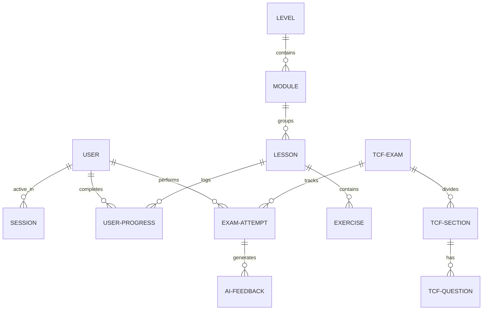

# Évora — AI-Powered French & TCF Canada Prep Platform

Évora is a state-of-the-art, full-stack language training suite engineered specifically to help candidates ace the **TCF Canada** (Test de connaissance du français pour le Canada) and **TCF Québec** exams. 

By marrying high-fidelity simulated exam modules with real-time **AI-driven diagnostics (Whisper & GPT-4o)**, Évora simulates an active human examiner. It awards estimated **Canadian Language Benchmarks (CLB)** scores, provides comprehensive lists of strengths and weaknesses, and details granular grammatical corrections with clear linguistic explanations.

---

## 🗺️ Platform Capabilities & Core Sections

Évora is structured into two main learning spaces: **The Academy** (foundational grammar, vocabulary, and progressive levels) and **The TCF Simulator** (official-grade simulated practice exams).

### 1. Academy Training Path (CEFR A1 – C2)
A fully mapped curriculum covering all Common European Framework of Reference (CEFR) levels.
*   **Structured Levels**: Levels (**A1, A2, B1, B2, C1, C2**) house individual modules.
*   **Targeted Lessons**: Lessons cover vocabulary registers, syntax construction, and reading comprehensions.
*   **Bite-sized Exercises**: Interactive units to validate knowledge retention:
    *   *Multiple Choice Questions (MCQs)*
    *   *Fill-in-the-Blanks (Cloze tests)*
    *   *Matching terms (lexicon associations)*
    *   *Short-form writing prompts*

### 2. TCF Canada Practice Simulator (The 4 Core Sub-Exams)
Simulates actual computer-based TCF Canada exams under strict, official time bounds.

| Exam Section | Format | Difficulty Distribution | AI Engine Tasks |
| :--- | :--- | :--- | :--- |
| **Compréhension Écrite**<br>*(Reading)* | 39 Multiple-choice questions | Progressive (A1 to C2) | Instant autograding against correct keys |
| **Compréhension Orale**<br>*(Listening)* | 39 Audio-prompt MCQs | Progressive (A1 to C2) | Natural voices synthesized via **ElevenLabs** |
| **Expression Écrite**<br>*(Writing)* | 3 Essay Tasks (emails, articles, debates) | Task 1: A1-A2<br>Task 2: B1-B2<br>Task 3: C1-C2 | Full essay evaluation, spelling, and vocabulary suggestions |
| **Expression Orale**<br>*(Speaking)* | 3 Recorded speech tasks (interviews, roleplays) | Task 1: A1-A2<br>Task 2: B1-B2<br>Task 3: C1-C2 | Audio transcription via **Whisper**, followed by grammatical assessment |

---

## 🧠 Advanced AI Diagnostics Architecture

The core value of Évora lies in its server-side AI pipeline that grades subjective writing and speaking tests instantly:

```
[Student Voice Recording] ──> [Whisper Speech-to-Text] ──> [Speech Transcript]
                                                                │
                                                                ▼
[AI-Generated Diagnostic Report] <── [GPT-4o Scoring Engine] <──┘
  - Estimated CLB Level (CLB 4 to 10+)
  - Structural strengths & weaknesses
  - Line-by-line grammar & spelling corrections
```

1.  **Audio Speech-to-Text**: Built on **OpenAI Whisper**; student recordings are transcribed cleanly, capturing grammatical hesitations.
2.  **Strict JSON Evaluation System**: **GPT-4o** assesses transcriptions or writing drafts against official TCF grading rubrics. It responds with a strict, type-safe JSON schema specifying:
    *   `overallScore`: 0–100 score.
    *   `clbLevel`: Estimated benchmark level (`CLB 4` to `CLB 10`).
    *   `strengths` / `weaknesses`: Specific performance lists.
    *   `corrections`: Array of `{ original, suggested, explanation }` representing precise inline corrections.
3.  **Local Offline Resiliency Fallback**: If the OpenAI service is unreachable, a complex local rule-based parsing engine takes over. It identifies common anglicisms, verb-subject mismatches, missing prepositions, and gender/number adjective conflicts, returning a reliable mock report to ensure training is never interrupted.

---

## 💳 Billing & Commercial Tiering (Stripe)
To balance infrastructure and API tokens costs, Évora uses **Stripe** to manage subscription tiers:
*   **FREE**: Basic access, 1 mock exam attempt, limited exercises.
*   **BASIC / PREMIUM / PRO**: Expanded simulated attempts, priority AI grading allocation, and full access to advanced C1/C2 material.
*   **Sandbox Sandbox Trigger**: Contains a local billing emulator route to easily toggle accounts to premium during development.

---

## ⚙️ Repository & Database Schema

The platform relies on **Prisma ORM** connecting to a **PostgreSQL** database. 



### Essential Database Tables:
*   `User`: Keeps email hashes, roles (`STUDENT`, `INSTRUCTOR`, `ADMIN`, `SUPER_ADMIN`), and Stripe subscription status.
*   `Lesson` & `Exercise`: Curates standard levels and structured learning paths.
*   `TcfExam` & `TcfQuestion`: Outlines practice tests, sections, durations, audio links, and MCQ keys.
*   `ExamAttempt` & `AIFeedback`: Logs student test timestamps, estimated CLB levels, and granular AI-generated structural reports.
*   `AIUsageLog`: Tracks Whisper/GPT usage logs for administrative overhead reviews.

---

## 🚀 Fast Start Local Development

The platform is split into a Next.js **frontend** client and an Express **backend** API server.

### 1. Spin up Database and Redis Infrastructure
In the root directory, run Docker to start PostgreSQL and Redis containers in detached mode:
```bash
docker-compose up -d
```

### 2. Launch the Backend API Server
Navigate to the `/backend` folder:
```bash
cd backend
npm install
npx prisma migrate dev  # Apply local DB migrations
npm run seed            # Load pre-made modules & exercises
npm run dev             # Start Express server on http://localhost:5001
```

### 3. Launch the Frontend Application
In a new terminal window, navigate to the `/frontend` folder:
```bash
cd frontend
npm install
npm run dev             # Start Next.js client on http://localhost:3000
```
